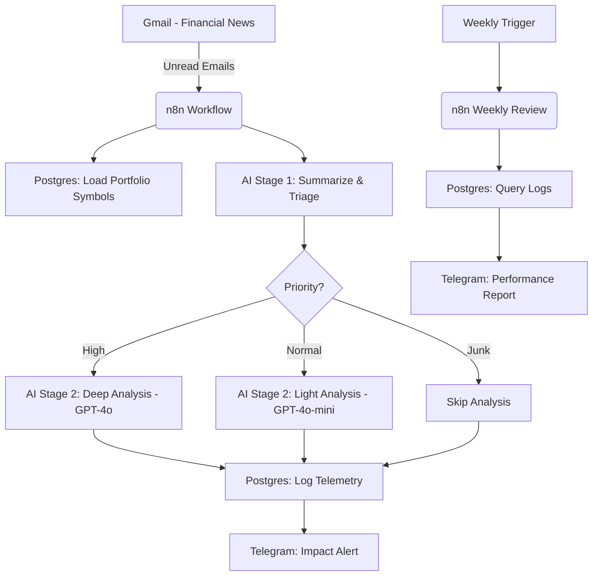

# AI-Powered Portfolio Impact Bot 📊

A sophisticated, event-driven system built on **n8n** that performs AI-powered analysis of financial news and assesses its specific impact on your investment portfolio.

The system fetches unread emails from Gmail, uses a multi-stage AI pipeline (OpenAI) to summarize and analyze content, logs results in PostgreSQL for telemetry, and delivers structured, actionable alerts via Telegram.

## 🚀 Key Features

- **Two-Stage AI Pipeline:**
  - **Stage 1 (Triage):** Uses a fast/cheap model to summarize noisy emails, extract articles, and prioritize them (High, Normal, Junk).
  - **Stage 2 (Analysis):** Uses a high-capability model for high-priority news to perform deep portfolio impact analysis.
- **Cost Optimization:** Dynamically selects the AI model based on the priority of the news, ensuring you only pay for "expensive" tokens when they matter most.
- **Robust State Management:** Designed with a "Context Object" pattern to ensure reliability and clean data flow without messy visual merges.
- **Defensive Programming:** Includes "Parser" and "Guard" nodes to safely handle and sanitize unpredictable AI outputs.
- **Telemetry & Analytics:** Logs every run to a PostgreSQL database, including model usage, performance, and actionable item counts.
- **Weekly Automated Reports:** A secondary workflow that analyzes your logs and sends a comprehensive performance and cost report via Telegram.

## 🛠 Tech Stack

- **n8n:** Workflow automation platform.
- **OpenAI:** GPT-4o and GPT-4o-mini for summarization and analysis.
- **PostgreSQL:** For storing portfolio data and workflow telemetry.
- **Telegram:** For real-time delivery of impact alerts and weekly reports.
- **Gmail:** Source for financial news and newsletters.

## 📐 Architecture

## 📸 Screenshots

### Impact Alerts
| Detailed Analysis (High Priority) | FYI / Summary (Normal Priority) |
| :---: | :---: |
|  |  |

### Weekly Analytics Report

## 🏁 Getting Started

To get your own bot up and running, follow the detailed guide in [SETUP.md](./SETUP.md).

1.  **Database:** Set up your PostgreSQL schemas using the scripts in `/database`.
2.  **n8n:** Import the workflows from `/n8n`.
3.  **Environment:** Configure your `.env` variables (see `.env.example`).
4.  **Credentials:** Set up Gmail (OAuth2), OpenAI, Telegram, and PostgreSQL credentials in n8n.

## 💎 Supporter Pack

The core "Portfolio Impact" workflow is open-source and free to use. For those who want more advanced analytics, the **Supporter Pack** includes:
-   The **Weekly Review** automated reporting workflow.
-   Advanced model configuration guides.
-   Priority support for setup.

[**Get the Supporter Pack on Buy Me a Coffee**](https://www.buymeacoffee.com/fabcarvalho/extras)

---

## ❤️ Support the Project

If you find this bot useful and want to support its ongoing development, you can buy me a coffee!

## 📄 License

This project is licensed under the MIT License - see the [LICENSE](LICENSE) file for details.
